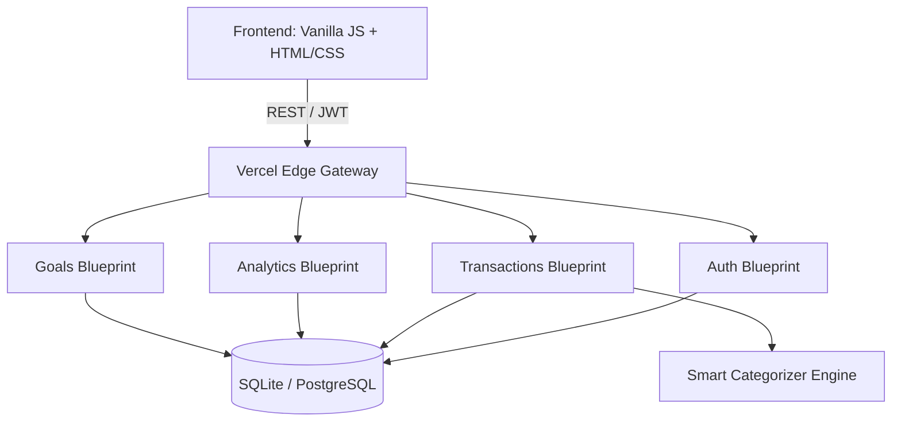

<div align="center">
  
  <h1>TrackFin Intelligence Platform</h1>
  <p><strong>A Modern, AI-Ready Personal Finance & Behavioral Analytics SaaS</strong></p>

  <p>
    <a href="https://track-fin-bay.vercel.app/" target="_blank">
      
    </a>
    
    
    
  </p>
</div>

---

## 📖 Overview

**TrackFin** is not just an expense tracker—it is a proactive behavioral finance engine. Built with modern web engineering principles, TrackFin transforms raw transaction data into intelligent financial recommendations, dynamic analytics, and gamified savings goals. 

The platform is designed with a premium, responsive **glassmorphism** UI and an architecture that supports seamless scaling.

## 🚀 Live Application

Experience the platform immediately without creating an account:
👉 **[Launch TrackFin Live](https://track-fin-bay.vercel.app/)**
*(Select **"Continue as Guest"** for an instant, secure sandbox environment).*

---

## ✨ Core Capabilities

### 🧠 Smart Heuristics & Categorization
* **Auto-Tagging Engine:** Employs keyword heuristics to automatically categorize unstructured transaction data (e.g., "Uber" → *Transportation*).
* **Subscription Detection:** Automatically flags recurring payments and calculates your 30-day fixed "Burn Rate."

### 📈 Behavioral Analytics
* **Algorithmic Health Score:** Dynamically calculates a financial health index (0–100) based on savings ratios, discretionary spending, and fixed costs.
* **Predictive Forecasting:** Estimates your end-of-month financial trajectory using moving averages.

### 🎯 Gamified Goal Management
* **Dynamic Savings Goals:** Create custom goals (e.g., "Emergency Fund", "New Laptop").
* **Visual Progress:** Interactive UI components that fill up in real-time as you log positive cash flow.

### 🔐 Frictionless & Secure Architecture
* **JWT-Based Authentication:** Stateless, scalable session management.
* **Guest Infrastructure:** Instantly provisions isolated, temporary accounts for zero-friction user onboarding and demoing.

---

## 🏗️ System Architecture

TrackFin is built on a decoupled client-server architecture, optimized for serverless deployments.



---

## 💻 Technical Stack

### Frontend Engineering
* **Languages:** HTML5, CSS3 (Vanilla), JavaScript (ES6+)
* **Design System:** Custom CSS tokens, Flexbox/Grid, Dark-mode Glassmorphism
* **Data Visualization:** Chart.js

### Backend Engineering
* **Framework:** Python 3.9+ / Flask (Blueprint Modular Routing)
* **ORM:** SQLAlchemy
* **Authentication:** PyJWT, Werkzeug Security (Argon2/PBKDF2)
* **Database:** SQLite (Configured for Ephemeral Serverless Storage `/tmp`)

### DevOps & Deployment
* **Hosting:** Vercel (Serverless Python Functions + Static Assets)
* **CI/CD:** Automated GitHub branch deployments

---

## ⚙️ Local Setup Instructions

1. **Clone the Repository:**
   ```bash
   git clone https://github.com/shekharsameer2308/TrackFin.git
   cd TrackFin
   ```

2. **Initialize Python Environment:**
   ```bash
   python -m venv venv
   source venv/bin/activate  # Windows: .\venv\Scripts\Activate.ps1
   ```

3. **Install Dependencies:**
   ```bash
   pip install -r backend/requirements.txt
   ```

4. **Start the Application:**
   ```bash
   python backend/app.py
   ```
   *The backend will boot on `http://localhost:5000`. You can serve the `frontend/` directory using any static web server (e.g., VS Code Live Server).*

---

## 🔭 Future Roadmap (AI Integration)

TrackFin is fully instrumented to accept state-of-the-art AI endpoints:
- **Receipt OCR Integration:** Connect Google Cloud Vision SDK to the `/api/transactions/ocr` endpoint to scan physical receipts.
- **Voice Logging:** Connect OpenAI Whisper to the `/api/transactions/voice` endpoint to allow users to say, *"I spent $15 on coffee today,"* and have it automatically logged and categorized.
- **Database Migration:** Upgrade the SQLAlchemy URI from SQLite to a managed PostgreSQL cluster (e.g., Supabase) for permanent production state.

---
<div align="center">
  <i>Engineered for the Modern Web.</i>
</div>
